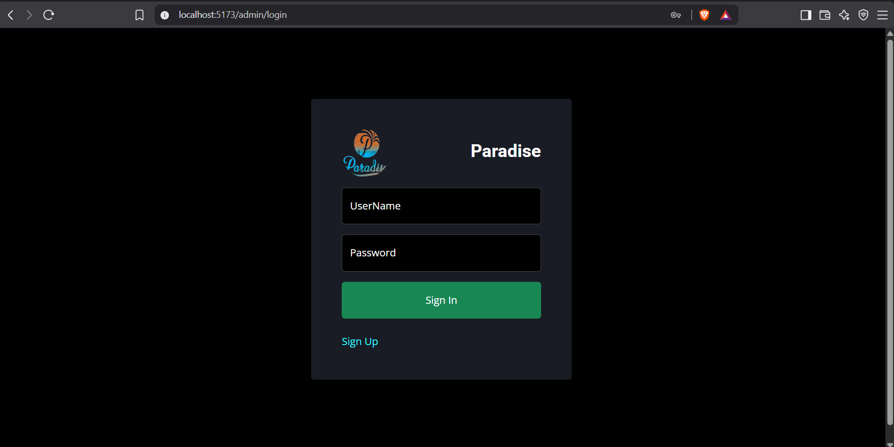
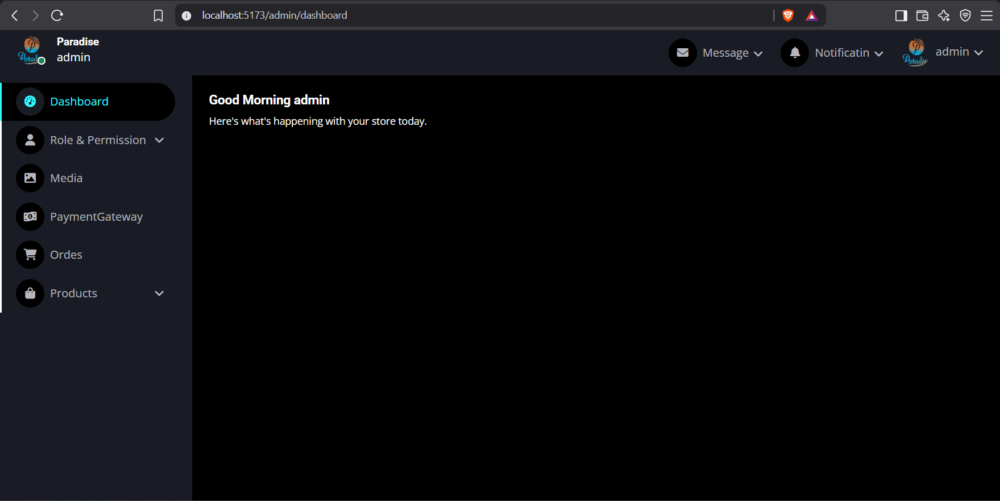
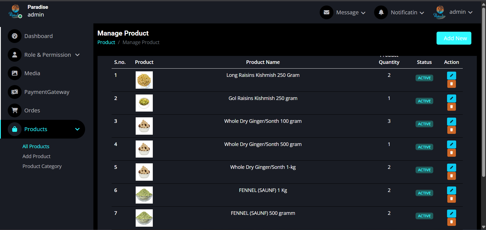
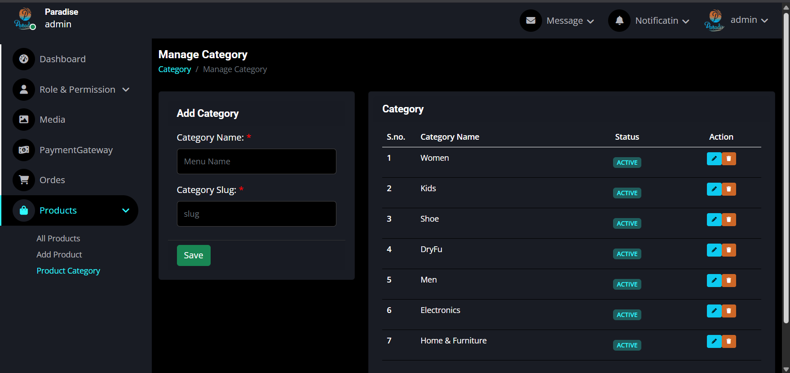
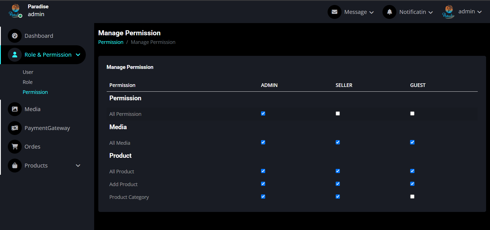

# React Admin Frontend Paradise

A modern and responsive **React.js Admin Dashboard** built for managing products, categories, users, roles, permissions, media, and other application resources through REST APIs.

This project was developed as the frontend of a full-stack application and focuses on building a practical, scalable admin panel with **React, Vite, Axios, React Context API, React Router, and permission-based UI controls**.

> **Frontend:** React.js + Vite
> **Backend:** Spring Boot REST API
> **Database:** MySQL

---

## 📸 Screenshots

### 🔐 Login



### 📊 Admin Dashboard



### 📦 Product Management



### 🗂️ Category Management



### 👤 Role & Permission Management



---

## 🚀 Project Overview

**React Admin Frontend Paradise** is an administration panel designed to provide a centralized interface for managing application data.

The frontend communicates with backend REST APIs and provides authenticated users with different screens and actions according to their assigned permissions.

The project demonstrates practical usage of React for building a real-world admin application rather than being only a UI template.

---

## ✨ Features

### 🔐 Authentication

* Admin login
* JWT-based authentication
* Protected routes
* Authentication state management
* Automatic authorization header handling
* Logout functionality

### 🛡️ Role & Permission Management

* Role-based access control
* Permission-based UI rendering
* Dynamic permission loading from API
* Hide/disable actions according to user permissions
* Protected administrative features

### 📦 Product Management

* Product listing
* Product creation
* Product editing
* Product deletion
* Product search/filtering
* Pagination
* Product image upload
* Product status management
* Product category assignment

### 🗂️ Category Management

* Create categories
* Update categories
* Delete categories
* Category status management
* Category listing

### 🖼️ Media & Image Management

* Image upload
* Product images
* Media management
* API-based image handling
* Preview/display uploaded images

### 📊 Data Management

* Server-side pagination
* Search and filtering
* API-driven data tables
* Loading states
* Error handling
* Success/error notifications

### 🎨 User Interface

* Responsive admin layout
* Sidebar navigation
* Protected navigation
* Reusable components
* Form validation
* Toast notifications
* Clean dashboard interface

---

## 🧰 Tech Stack

| Technology        | Purpose                        |
| ----------------- | ------------------------------ |
| React.js          | Frontend framework             |
| Vite              | Development/build tool         |
| JavaScript        | Application logic              |
| React Router DOM  | Routing                        |
| Axios             | REST API communication         |
| React Context API | Global state management        |
| Bootstrap         | UI styling                     |
| Toastify          | Notifications                  |
| Swiper            | UI sliders/components          |
| CKEditor          | Rich text editing              |
| Spring Boot       | Backend REST API               |
| Spring Security   | Authentication & authorization |
| JWT               | Token-based authentication     |
| Spring Data JPA   | Database access                |
| Hibernate         | ORM                            |
| MySQL             | Database                       |

---

## 🏗️ Application Architecture

The application follows a frontend/backend separation architecture:

```text
┌──────────────────────────────┐
│        React Admin UI        │
│                              │
│  Dashboard                   │
│  Products                    │
│  Categories                  │
│  Users                       │
│  Roles & Permissions         │
│  Media                       │
└──────────────┬───────────────┘
               │
               │ REST API
               │ Axios
               ▼
┌──────────────────────────────┐
│       Spring Boot API        │
│                              │
│  Controllers                 │
│  Services                    │
│  Repositories                │
│  Spring Security             │
│  JWT Authentication         │
└──────────────┬───────────────┘
               │
               │ JPA / Hibernate
               ▼
┌──────────────────────────────┐
│            MySQL             │
└──────────────────────────────┘
```

---

## 📁 Project Structure

```text
src/
├── assets/
├── components/
├── context/
├── pages/
├── services/
├── routes/
├── layouts/
├── providers/
├── App.jsx
└── main.jsx
```

The exact folder organization may evolve as new modules are added.

---

## 🔄 API Communication

The application communicates with the backend using **Axios**.

Example:

```javascript
const response = await ApiService.fetchData(
    "role-permission/permission/all-permission"
);
```

API communication is centralized so that authentication tokens, requests, responses, and error handling can be managed consistently.

---

## 🔑 JWT Authentication Flow

```text
User
 │
 ▼
Login Page
 │
 ▼
Spring Boot Authentication API
 │
 ▼
JWT Token
 │
 ▼
React Application
 │
 ▼
Store Authentication State
 │
 ▼
Attach JWT to API Requests
 │
 ▼
Protected Backend APIs
```

This allows authenticated users to access protected resources while the backend remains responsible for enforcing actual authorization.

---

## 🛡️ Permission-Based UI

One of the important parts of the project is permission-based rendering.

For example:

```text
User
 │
 ├── Role
 │
 └── Permissions
       ├── Product View
       ├── Product Create
       ├── Product Update
       ├── Product Delete
       ├── Category View
       └── Category Manage
```

The frontend uses these permissions to control which navigation items, buttons, forms, and actions are displayed to the user.

> **Note:** Frontend permission checks improve the user experience, but the backend must always enforce authorization for security.

---

## 📄 Pagination & Filtering

Large datasets are handled through API-based pagination rather than loading every record into the browser.

Example API pattern:

```text
product/all-product?page=0&size=15&filterdata=
```

This allows the admin panel to efficiently display large product collections while supporting searching and filtering.

---

## 🖼️ Image Upload

The application supports image uploads for resources such as products and media.

The frontend sends image data using `multipart/form-data` to the backend API.

```text
React Form
    │
    ▼
Select Image
    │
    ▼
FormData
    │
    ▼
Axios
    │
    ▼
Spring Boot Multipart API
    │
    ▼
Store Image
```

---

## ⚙️ Installation

### 1. Clone the repository

```bash
git clone https://github.com/NiteshSultaniya/React-Admin-Frontend-Paradise.git
```

### 2. Enter the project directory

```bash
cd React-Admin-Frontend-Paradise
```

### 3. Install dependencies

```bash
npm install
```

### 4. Start the development server

```bash
npm run dev
```

Vite will provide the local development URL in the terminal.

---

## 🔗 Backend Configuration

This frontend is designed to communicate with a REST API backend.

Before running the application, configure the API base URL according to your backend environment.

Example:

```javascript
const API_BASE_URL = "http://localhost:9090/";
```

Make sure the Spring Boot backend is running before using features that require API communication.

---

## 🌐 Backend

The frontend can be connected to a Spring Boot backend providing APIs for:

* Authentication
* Admin users
* Roles
* Permissions
* Products
* Categories
* Media
* File uploads
* Pagination
* Search/filtering

---

## 📱 Responsive Design

The admin interface is designed to work across common desktop and tablet screen sizes.

The layout includes:

* Responsive sidebar
* Dashboard cards
* Responsive tables
* Forms
* Navigation
* Data management screens

---

## 🧪 Development

Run the development server:

```bash
npm run dev
```

Build the application:

```bash
npm run build
```

Preview the production build:

```bash
npm run preview
```

---

## 🎯 What This Project Demonstrates

This project demonstrates practical experience with:

* React component architecture
* REST API integration
* Axios
* JWT authentication
* Protected routes
* Role-based permissions
* React Context
* CRUD operations
* Pagination
* Search and filtering
* File uploads
* Form handling
* API error handling
* Responsive admin UI
* Integration with Spring Boot

---

## 📌 Project Status

**Status:** Active development

The project can be extended with additional modules, analytics, advanced reporting, improved testing, and further UI enhancements.

---

## 👨‍💻 Author

**Nitesh Sultaniya**

Java / Spring Boot & React Developer

### GitHub

[github.com/NiteshSultaniya](https://github.com/NiteshSultaniya)

---

## ⭐ Support

If you find this project useful or interesting, consider giving the repository a ⭐ on GitHub.

---

## 📄 License

This project is available for learning and portfolio purposes.
